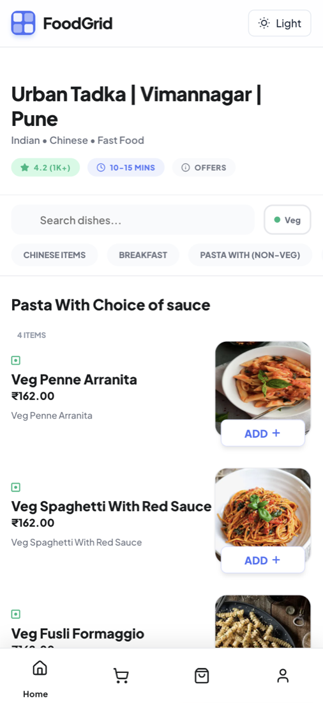
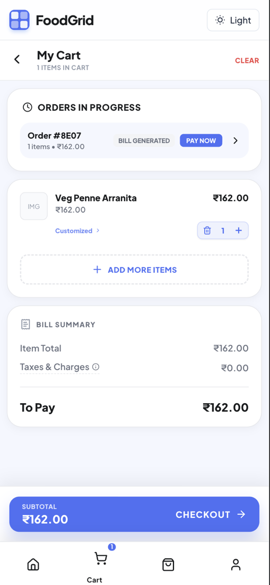
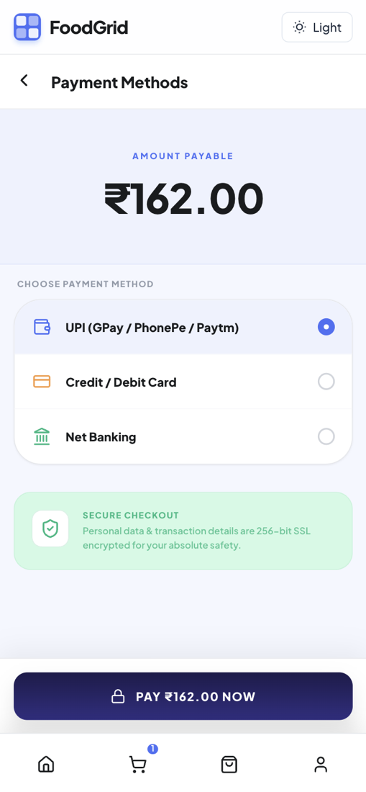
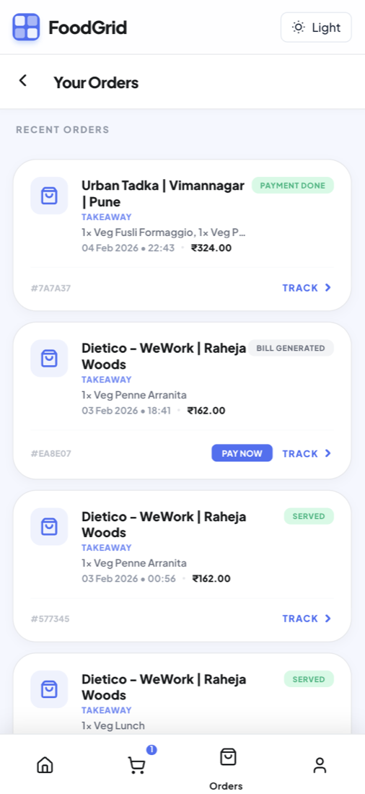
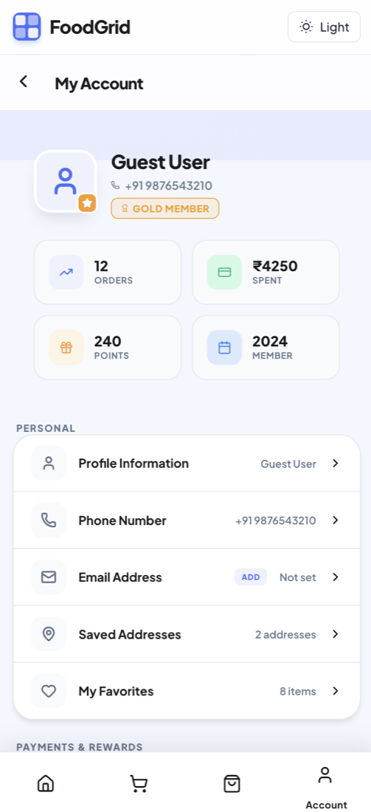
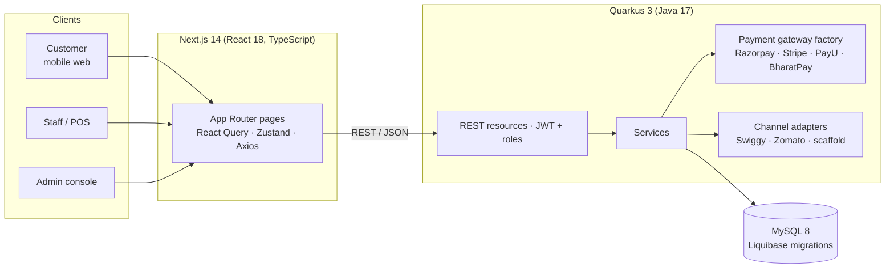

<div align="center">

# 🍽️ FoodGrid

**A multi-tenant restaurant management and POS platform — from QR-code ordering at the table to kitchen, billing and analytics.**


</div>

---

## Overview

Running a restaurant means juggling the dining room, the kitchen, the cash desk and the owner's dashboard. **FoodGrid** puts them on one platform:

- **Diners** scan a QR code, browse the menu on their phone, order, and pay — no waiting for a waiter.
- **Staff** take and track orders from a POS, with PIN-based shift login.
- **Owners** manage outlets, menus, inventory, tables, employees and payments from an admin console.
- **The platform** is multi-tenant: many restaurant clients, each with several outlets, on a single deployment.

## Screenshots

Customer ordering flow (mobile web):

| Menu | Cart | Payment | Orders | Account |
|:---:|:---:|:---:|:---:|:---:|
|  |  |  |  |  |

## Features

**Customer ordering**
- Outlet menu with categories, search, veg filter and item customisation
- Cart, bill summary, live order status (bill generated → payment done → served)
- Payment-method selection (UPI, card, net banking) and order history
- Customer sign-in with OTP verification or Google

**Staff & POS**
- Employee PIN login per shift, linked to a device
- Order and table operations, shift handling, kitchen view
- Role-based access: `SUPER_ADMIN`, `TENANT_ADMIN`, `CLIENT_ADMIN`, `ADMIN`, `MANAGER`, `CASHIER`, `POS_USER`, `CUSTOMER`

**Admin console**
- Dashboard and analytics (per client and platform-wide)
- Outlets, tables, menu, ingredients and inventory management
- Employees, roles, schedules and registered devices
- Payment configuration and transaction history

**Payments**
- Pluggable gateway layer using the Factory pattern: **Razorpay, Stripe, PayU and BharatPay**
- Per-client gateway configuration, webhook handling and refunds
- See [`backend/quarkus/docs/PAYMENT_GATEWAY.md`](backend/quarkus/docs/PAYMENT_GATEWAY.md) for the design

**Platform**
- Schema versioned with Liquibase (17 changelogs)
- JWT authentication (SmallRye JWT), OpenAPI spec exposed at `/openapi`
- Public demo mode (`/demo`) and a free-trial sign-up flow
- Docker and native-image Dockerfiles for the backend

## Architecture



The backend is organised by domain — `auth`, `admin`, `payment`, `integration`, `lead`, `demo` and `common` — each with its own `rest`, `service`, `repo`, `model` and `dto` layers. See [`backend/quarkus/ER_Diagram.md`](backend/quarkus/ER_Diagram.md) for the data model.

## Tech stack

| Layer | Technology |
|---|---|
| Backend | Quarkus 3.24, Java 17, Hibernate ORM with Panache, Liquibase, SmallRye JWT & OpenAPI, REST Client, Scheduler, Mailer |
| Frontend | Next.js 14, React 18, TypeScript, TanStack Query, Zustand, Axios |
| Database | MySQL 8 |
| Tooling | Docker, Docker Compose |

## Getting started

### Prerequisites

- JDK 17+ and Maven
- Node.js 18+ and npm
- Docker (for MySQL)

### 1. Start the database

```bash
docker compose up -d      # MySQL 8 on localhost:3306, database "foodgrid_db"
```

### 2. Run the backend

```bash
cd backend/quarkus

# Generate your own JWT signing keys (never commit these)
mkdir -p src/main/resources/jwt
openssl genpkey -algorithm RSA -pkeyopt rsa_keygen_bits:2048 -out src/main/resources/jwt/privateKey.pem
openssl rsa -pubout -in src/main/resources/jwt/privateKey.pem -out src/main/resources/jwt/publicKey.pem

# Point the app at your local database (Quarkus reads these environment variables)
export QUARKUS_DATASOURCE_JDBC_URL="jdbc:mysql://localhost:3306/foodgrid_db?useSSL=false&allowPublicKeyRetrieval=true"
export QUARKUS_DATASOURCE_USERNAME=root
export QUARKUS_DATASOURCE_PASSWORD=foodgrid

mvn quarkus:dev           # http://localhost:8080 · OpenAPI at /openapi
```

Liquibase applies the schema automatically on start-up. Extra SQL for local data lives in [`db/`](db).

### 3. Run the frontend

```bash
cd frontend/nextjs
npm install

cat > .env.local <<'EOF'
NEXT_PUBLIC_API_BASE=http://localhost:8080
NEXT_PUBLIC_DEVICE_ID=local-dev-device
NEXT_PUBLIC_OUTLET_ID=
NEXT_PUBLIC_GOOGLE_CLIENT_ID=
EOF

npm run dev               # http://localhost:3000
```

Open `http://localhost:3000/demo` to explore the demo mode.

## Project structure

```
FoodGrid/
├── backend/quarkus/        # Quarkus API (domains: auth, admin, payment, integration, lead, demo)
│   ├── src/main/resources/db/changelog/   # Liquibase migrations
│   └── docs/PAYMENT_GATEWAY.md
├── frontend/nextjs/        # Next.js app (customer, staff, client-admin, demo, public pages)
├── db/                     # Schema and seed SQL
├── docs/screenshots/       # README images
└── docker-compose.yml      # Local MySQL
```

## Project status

FoodGrid is under active development. Honest notes on where it stands:

- ✅ Customer ordering, admin console, role-based auth and the payment-gateway layer are built.
- 🚧 **Swiggy / Zomato channel adapters are scaffolds** — the integration model and endpoints exist, but the real partner API calls are not implemented yet.
- 🚧 Automated test coverage is minimal; adding tests around authentication and payments is the next priority.
- 🗺️ Planned: CI pipeline, PhonePe and Cashfree gateways, and a public hosted demo.

## Author

Built by **Souraj Pal** — [GitHub](https://github.com/cureius) · [LinkedIn](https://www.linkedin.com/in/souraj-pal/)
